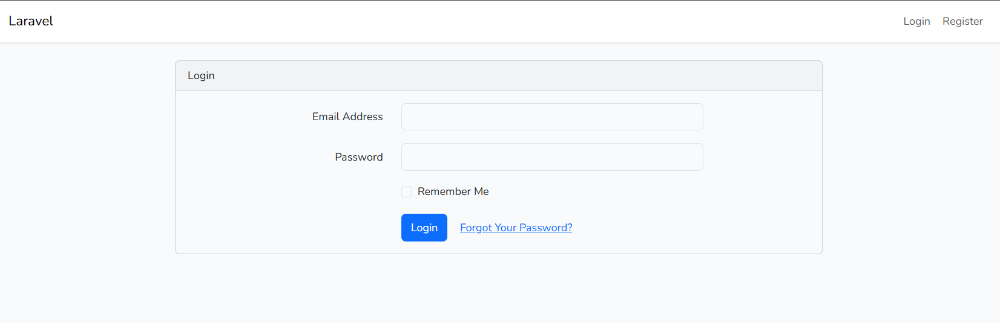
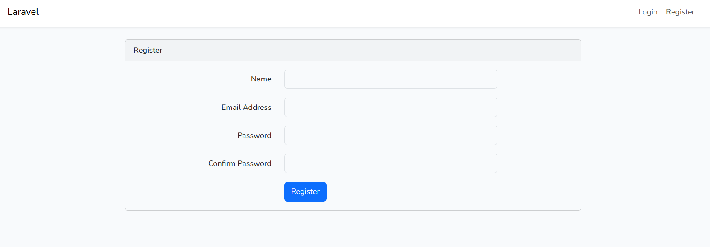
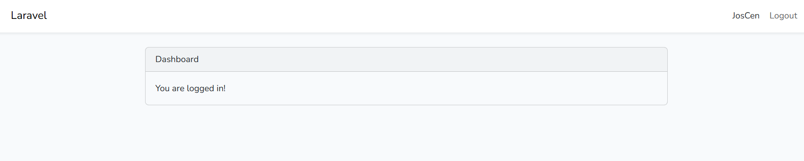
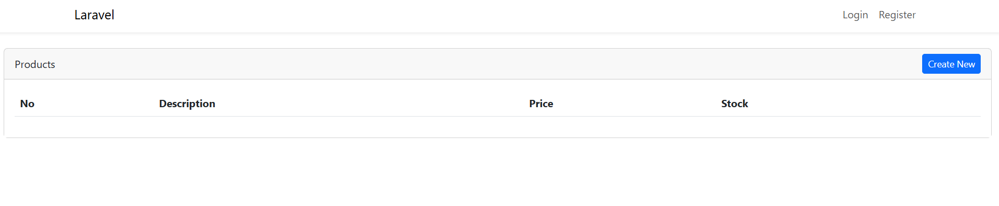
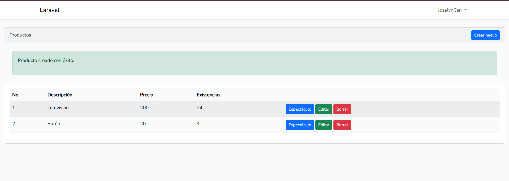

# Laboratorio #3: CRUD en Laravel

## Objetivo del Laboratorio

Implementar un sistema CRUD (Create, Read, Update, Delete) en Laravel utilizando el patrón MVC, con autenticación de usuarios y conexión a base de datos MySQL.

---

# ⚙️ Instalación del Proyecto

```bash
composer create-project laravel/laravel Crud_Lab3
cd Crud_Lab3
composer install
cp .env.example .env
php artisan key:generate
```

# 🔐 Autenticación (Login y Registro)`

```bash
composer require laravel/ui
php artisan ui bootstrap --auth
npm install
npm run dev
```

# 🧩 CRUD de Productos

```bash
composer require ibex/crud-generator
php artisan vendor:publish --tag=crud
php artisan make:crud products
```

# 🗄️ Configuración de Base de Datos

```env
DB_CONNECTION=mysql
DB_HOST=127.0.0.1
DB_PORT=3306
DB_DATABASE=crud_lab3
DB_USERNAME=root
DB_PASSWORD=
```

# 📊 Migraciones

```bash
php artisan migrate
```

Si hay errores:

```bash
php artisan migrate:fresh
```

# 🌐 Ejecución del Proyecto

```bash
php artisan serve
```

Acceder en el navegador:

```bash 
http://127.0.0.1:8000/
```

# 📦 Funcionalidades
* 🔐 Registro e inicio de sesión
* 📋 Listar productos
* ➕ Crear productos
* ✏️ Editar productos
* 🗑️ Eliminar productos

# 🖼️ Evidencias del Sistema
## 🔐 Inicio de sesión


## 📝 Registro


## 📊 Dashboard


## 📦 Lista de productos/Crear nuevo


## ✏️ Editar producto


## 🗄️ Base de Datos
* Se utilizó MySQL
* Laravel gestiona la conexión mediante .env
* Las tablas se generaron con migraciones

---

**Este laboratorio ha sido desarrollado por el estudiante de la Universidad Tecnológica de Panamá:**

- 👤 **Nombre:** Joselyn Cención  
- 📧 **Correo:** joselyn.cencion@utp.ac.pa  
- 📘 **Curso:** Desarrollo de Software VII  
- 👩‍🏫 **Instructor:** Ing. Irina Fong  
- 📅 **Fecha:** 27 de abril de 2026

---
